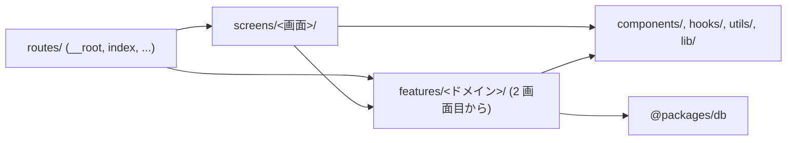

# ディレクトリ構成

`apps/app` の置き場所の規約。**新しいファイルを作る前にここを読み、[置き場所の判断フロー](#置き場所の判断フロー)で置き場所を決める。**

## 考え方

置き場所は、次の 4 つで決まる。

1. [URL の定義と画面の実体を分ける](#url-の定義と画面の実体を分ける)
2. [ひとまとまりのものは 1 か所にまとめる](#ひとまとまりのものは-1-か所にまとめる)
3. [まとまりどうしは参照しない](#まとまりどうしは参照しない)
4. [2 つ目の参照元が現れてから外に出す](#2-つ目の参照元が現れてから外に出す)

### URL の定義と画面の実体を分ける

`routes/` は **URL を定義する場所**であって、画面を書く場所ではない。ルートファイルはルートの契約（URL・`head`・`loader`・パラメータの受け取り）だけを持ち、画面の実体は `screens/` にある。

分ける理由は 2 つある。

- **ルートの入れ子は URL 設計で決まっていて、コードの凝集で決まっていない。** 画面の中身を `routes/` に置くと、URL を変えただけでコードが丸ごと動く
- **`routes/` の中では、TanStack Router が名前でファイルを解釈する。** `__root.tsx` や `$slug.tsx` のような綴りが規約であり、`routeTree.gen.ts` の生成対象にもなる。`routes/` の外なら、この衝突は起こらない

### ひとまとまりのものは 1 か所にまとめる

ユーザー一覧を出すには、取得・型・カード・整形が要る。これを `api/` `types/` `components/` `utils/` のように**技術で振り分けると、1 つ直すのに 4 か所を開く**ことになる。

そこで、まとまりごとにディレクトリを切り、その中に全部入れる。

```text
screens/user-list/components/users/
├─ index.tsx          一覧
├─ user-card.tsx      1 件の表示
├─ types.ts           型
├─ utils.ts           整形
└─ api/get-users.ts   取得
```

こうすると、**そのまとまりを触るときに開くディレクトリが 1 つで済む。** 別の場所から使いたくなったときも、ディレクトリごと動かせる。

**まとまりの名前は、関係者と共有できる言葉で付ける。** 企画やデザインの会話に出てくるページとセクションの名前がそれ。「SSR 用」「クライアント用」のような、どう実装するかによる区切りでは切らない。エンジニアしか使わない言葉で切ると、話すたびに境界が動く。

### まとまりどうしは参照しない

`users/` から `orders/` を import しない。**参照した瞬間、片方を触るともう片方が壊れる。** まとまりに切った意味がそこで消える。

組み合わせるのは 1 つ上の `index.tsx` の仕事。両方から使いたいものが出てきたら、1 つ上へ出す。

### 2 つ目の参照元が現れてから外に出す

「あとで使うかも」で外に出さない。**器を先に作っても、中身が 1 つでは読みやすくならない。** 増えるのは階層と import の距離だけになる。

出す先は、実際に何か所から使うかで決まる。

| 何か所から使うか | 置き場所 | 例 |
| --- | --- | --- |
| 1 つのまとまりの中だけ | そのまとまりの中 | `users/user-card.tsx` |
| 同じ画面の複数のまとまりから | `screens/<画面>/` の `components/` `hooks/` `types/` `utils/` | `screens/user-list/components/empty-state.tsx` |
| 複数の画面から。ドメインを持たない | `components/ui/`・`components/layout/` | `components/ui/button.tsx` |
| 複数の画面から。ドメインを持つ | `features/<ドメイン>/` | `features/users/` |

出す前と後で、中の形は変わらない。動かすのはディレクトリの位置と import のパスだけ。

**ドメインを持つものも例外にしない。** ユーザーを扱うのが 1 画面だけなら `screens/user-list/components/users/` に置く。2 つ目の画面が使い始めたら `features/users/` へ上げる。

## 全体像

```text
apps/app/
├─ scripts/                ビルド・運用時だけ動くコード。ブラウザに載らない
├─ public/                 そのまま配信される静的ファイル
└─ src/
   ├─ routes/              URL の定義だけ。画面の実体は置かない
   ├─ screens/             画面の実体。1 画面 1 ディレクトリ
   │  └─ <画面>/
   │     ├─ index.tsx      まとまりを並べて 1 画面にする
   │     ├─ components/    その画面で使う部品
   │     │  └─ <まとまり>/  そのまとまりの部品・型・データを全部入れる
   │     ├─ hooks/         その画面だけの状態・副作用
   │     ├─ types/         その画面だけの型
   │     └─ utils/         その画面だけの整形・計算
   ├─ components/          ドメインを知らない共有部品
   │  ├─ ui/               単体で完結する UI 部品
   │  └─ layout/           サイト共通の枠
   ├─ hooks/               ドメインを知らない共有 hooks
   ├─ utils/               ドメインを知らない純粋関数
   ├─ lib/                 外部ライブラリをこのアプリ用に設定したもの
   ├─ styles/              グローバル CSS
   ├─ router.tsx           ルーター定義
   └─ routeTree.gen.ts     TanStack Router が生成。手で触らない
```

たとえばユーザー一覧の画面なら、こうなる。

```text
src/screens/user-list/
├─ index.tsx                    まとまりを並べて 1 画面にする
├─ components/
│  ├─ users/                    ユーザーの取得・型・一覧表示
│  │  ├─ index.tsx
│  │  ├─ user-card.tsx
│  │  ├─ types.ts
│  │  └─ api/get-users.ts
│  └─ empty-state.tsx           複数のまとまりから使う空表示
└─ hooks/                       この画面だけの状態・副作用
```

`empty-state.tsx` が `components/` 直下にあるのは、**複数のまとまりから使うから**。`users/` は 1 まとまりでしか使わないので、そのディレクトリに閉じている。

**`features/` はここにない。** 2 つ目の画面が同じドメインを使い始めたときに作る（[2 つ目の参照元が現れてから外に出す](#2-つ目の参照元が現れてから外に出す)）。作るときの形は次のとおり。

```text
   ├─ features/            2 つ以上の画面から使うドメイン
   │  └─ <ドメイン>/
   │     ├─ api/           そのドメインのデータ取得（server function）
   │     ├─ components/    そのドメインを表示する部品
   │     ├─ hooks/         そのドメインの状態・副作用
   │     ├─ types/         そのドメインの型
   │     └─ utils/         そのドメインの整形・計算
```

どの階層も、**必要なディレクトリだけ作る。** 全部そろえない。1〜2 個のうちは `index.tsx` の横に平置きし（`users/types.ts`）、3 つ目が来てから `types/` を掘る。

`components/ui`・`components/layout`・`hooks`・`utils` は空の状態で始まる。**必要になったらこのパスに作る。別の名前のディレクトリを新設しない。**

`scripts/` はサブディレクトリを作らずフラットに置き、ファイル名で役割を表す。

**`screens/<画面>/api/` は作らない。** データ取得は `routes/` の `loader` から呼ぶ。呼ぶ先は、そのまとまりを使うのが 1 画面のうちは `screens/<画面>/components/<まとまり>/api/`、`features/` へ上げたあとは `features/<ドメイン>/api/`。複数のまとまりをまたぐ画面も、組み合わせるのは `loader` の仕事。

### まとまりと共有層の違い

`components/` `hooks/` `utils/` `lib/` をまとめて**共有層**と呼ぶ。ここには**ドメインの言葉で名前が付かないもの**だけを置く。付くなら、まとまりの単位で 1 ディレクトリにする。

`lib/` は**外部ライブラリをこのアプリ用に設定したもの**を置く場所である。fetch の shim、クライアント SDK のラッパーなど。ドメインは入らない。

| 置きたいもの | 行き先 |
| --- | --- |
| ユーザーの取得・型・一覧表示 | `screens/<画面>/components/users/`。2 画面目が使ったら `features/users/` |
| fetch の差し替え | `lib/` |
| 日付を整形する | `utils/` |
| ボタン・モーダル | `components/ui/` |

**1 つのまとまりを技術で切り分けて別の場所に置かない。** 同じ名前のディレクトリが何か所にもでき、そのたびにどちらに置くかを考えることになる。ユーザーの型・取得・表示は、どこにあろうと 1 か所にまとめる。

`lib/` の切り方は bulletproof-react と同じ。向こうでも `lib/` は「アプリ用に事前設定された再利用可能なライブラリ」で、ドメインに属するものは api・components・hooks・types まで全部 1 つのディレクトリに入る。違うのは、そのディレクトリを最初からアプリ直下に置くか、使う画面の中に置くかだけ。

### `@packages/*` の扱い

| パッケージ | 誰が触るか |
| --- | --- |
| `@packages/db` | ドメインの `api/` だけ |
| `@packages/auth` | 制限しない |

`@packages/db` はデータそのものなので、ドメインの中に閉じる。**画面や共有層から DB を引かない。**

`@packages/auth` の `auth-client` は better-auth が用意するクライアント SDK で、性質としては `lib/` に置くものと同じ。ドメインではないので、画面から直接使ってよい（bulletproof-react も認証クライアントを `lib/` に置いている）。サーバー側の `auth` は `routes/api/auth/` が使う。

**DB スキーマの型を画面まで通さない。** `@packages/db` の型が要るときは、そのドメインの `types/` で受けてから渡す（`users/types/user.ts`）。ここを挟んでおくと、テーブル定義を変えても画面側の import が動かない。

### 画面のディレクトリは URL の入れ子を写さない

`screens/` はフラットに並べ、**画面そのものを指す言葉**で名前を付ける。

| ルート | ルートファイル | 画面 |
| --- | --- | --- |
| `/` | `routes/index.tsx` | `screens/top/` |
| `/login` | `routes/login.tsx` | `screens/login/` |
| `/users/<id>` | `routes/users/$id.tsx` | `screens/user-detail/` |

URL を写すと、`routes/` と同じ木がもう 1 本できて、URL を変えるたびに両方を動かすことになる。名前を画面側の言葉にしておけば、導線の都合で URL が変わっても画面は動かない。

### `-` で始まるディレクトリは使わない

TanStack Router は `-` で始まるファイル・ディレクトリをルート生成から除外するので、`routes/-components/` のようにコロケーションもできる。**これは使わない。**

画面の実体を `routes/` の外に置けば、ルーティング対象かどうかを名前で示す必要がなくなる。`routes/` にあるものは全部 URL の定義、それ以外は全部 `routes/` の外、という 1 本の線で足りる。

### `screens` という名前

`pages` にしない。`routes` と `pages` は語としてほぼ同義で、**URL の定義と画面の実体という違いが名前から読み取れない。** `screens` なら、ルーティングの話をしているのか画面の話をしているのかが、パスを見た時点で分かる。

`screens/<画面>/` の仕事は、**まとまりを並べて 1 画面にすること。** `index.tsx` 自体は中身のロジックを持たない。

## 置き場所の判断フロー

新しいファイルを作るとき、上から順に当てはめる。

1. **ビルド時・運用時にしか動かないか**（Vite plugin、生成スクリプト、Node API を使う）→ `scripts/`
2. **URL を増やす／変えるか** → `src/routes/`
3. **画面そのものか** → `src/screens/<画面>/index.tsx`
4. **ひとまとまりで名前が付くか**（ユーザー、注文、お問い合わせ）→ 使う画面が 1 つなら `src/screens/<画面>/components/<まとまり>/`、2 つ以上なら `src/features/<ドメイン>/`
5. **その画面の組み立てにしか意味がないか** → `src/screens/<画面>/` の `components/` `hooks/` `types/` `utils/`
6. **ドメインを知らない表示部品か** → `src/components/ui/`・`src/components/layout/`
7. **ドメインを知らない hooks か** → `src/hooks/`
8. **副作用のない汎用関数か** → `src/utils/`
9. **外部ライブラリの設定・ラッパーか** → `src/lib/`

**迷ったら 4。** 企画やデザインの会話で名前が出てくるなら、そのまとまりで 1 ディレクトリにする。

4 と 5 で掘るディレクトリの名前は同じなので、置き場所だけ見ると区別が付かない。違うのは、**その中身がまとまりの名前で説明できるか、その画面の都合でしかないか**だけ。「ユーザー一覧カード」は 4、「ログイン画面のモード切替ボタン」は 5 になる。

4 でまとめておけば、2 つ目の画面が同じものを使い始めたとき、**そのディレクトリごと `features/` へ動かすだけで済む。** 型・取得・表示が散っていると、この移動が段違いに重くなる。

## 各ディレクトリの責務

| 場所 | 責務 | やらないこと |
| --- | --- | --- |
| `scripts/` | 生成処理、デプロイ補助、Vite plugin | React を書く |
| `src/routes/**/*.tsx` | URL の契約。`head`・パラメータの受け取り・`loader` からドメインのデータ取得を呼ぶ。受け取った値を `screens/` へ渡す | マークアップを書く。整形・集計する。DB を引く |
| `src/screens/<画面>/index.tsx` | 画面の組み立て。まとまりを並べる | URL を知る。`head` を持つ。まとまりの中身を持つ |
| `src/screens/<画面>/components/<まとまり>/` | そのまとまりのデータ取得・型・表示・整形 | 他のまとまりを参照する。画面と URL を知る |
| `src/screens/<画面>/` の `components/` `hooks/` `types/` `utils/` | その画面の組み立てにしか使わないもの | 他の画面から参照される |
| `src/features/<ドメイン>/` | 2 つ以上の画面から使うドメイン。中身の責務は上と同じ | 他の features を参照する。画面と URL を知る |
| `src/components/ui/` | 単体で完結する見た目の部品 | ドメインの型を知る |
| `src/components/layout/` | サイト共通の枠 | ドメインの型を知る |
| `src/hooks/` | ドメインを知らない React の状態・副作用 | ドメインの型を知る |
| `src/utils/` | 副作用のない純粋関数 | ドメインの型を知る。React に依存する |
| `src/lib/` | 外部ライブラリのラッパー・設定 | ドメインを知る |

**まとまりの責務は、`screens/` の中にあっても `features/` に上げても変わらない。** 変わるのは何画面から使えるかだけ。だから移すのはディレクトリの位置だけで済む。

ルートファイルを薄く保つのは、**URL の契約と、中身の実装を別々に読めるようにするため。** 画面を `screens/` に置いておけば、URL を変えても画面は動かない。

## 依存の方向

矢印の向きにだけ import する。逆向きが必要になったら、設計を間違えている。



守るルール。

- **`src/` から `scripts/` を import しない。** ブラウザに Node のコードが載る
- **まとまりどうしは参照しない。** `screens/user-list/components/users/` から `screens/user-list/components/orders/` を import しない。組み合わせるのは `screens/<画面>/index.tsx` の仕事。両方から使いたくなったら 1 つ上へ出す
- **画面どうしは参照しない。** `screens/<画面A>/` から `screens/<画面B>/` を import しない。他の画面が欲しがったら、それが `features/` へ上げる合図
- **`features/` から `screens/`・`routes/`・他の `features/` を import しない。** ドメインが画面や URL に依存すると、別の画面から使えなくなる
- **`screens/` から `routes/` を import しない。** 画面が URL を知ると、URL を変えたときに画面が壊れる
- **共有層（`components/` `hooks/` `utils/` `lib/`）は `features/`・`screens/`・`routes/` を import しない。** ドメインを知らない部品にしておく
- **`@packages/db` に触るのは、そのまとまりの `api/` だけ。** 画面・共有層・`routes/` から DB を引かない
- **`routes/` にロジックを書かない。** `loader` の中で組み立てたくなったら、ドメインのディレクトリへ出す

`routeTree.gen.ts` はこの向きの対象外。TanStack Router が全ルートを集める生成物なので、手で編集しない。

### lint で強制している

最後の 1 つ（`routes/` にロジックを書かない）以外は `.oxlintrc.json` の `overrides` + `no-restricted-imports` で `pnpm lint` が落ちる。違反すると、どこに置くべきかを書いたメッセージが出る。

| ここから | これを import できない |
| --- | --- |
| `src/routes/**` | `scripts/`、`@packages/db` |
| `src/screens/**` | `scripts/`、`routes/`、他の画面、`@packages/db` |
| `src/features/**` | `scripts/`、`routes/`、`screens/`、他の features |
| `src/components/**`・`src/hooks/**`・`src/utils/**`・`src/lib/**` | `scripts/`、`routes/`、`screens/`、`features/`、`@packages/db` |

知っておくべき制約が 2 つある。

- **oxlint の `overrides` は、同じルールが複数のブロックにマッチすると最後のブロックが前のブロックを置き換える**（合成されない）。そのためディレクトリごとのブロックに共通ルールを書き写している。ルールを足すときは該当する全ブロックに入れる
- **判定は import 文の文字列に対するパターンマッチで、解決後のパスではない。** そのため `@/` エイリアス形（`@/screens/**`）に加えて、相対パス形（`**/screens/**`）も同じ group に入れて塞いである。`../../screens/top` のような書き方でも落ちる

ドメイン直下のファイル（`features/<ドメイン>/*.ts`）は `../` が必ずドメインの外に出るので、そこだけ `../**` も禁止している。**ドメインの中で 2 階層以上さかのぼって隣のドメインへ行く形だけは、正当な `../../types/...` と文字列で区別できないため lint に入れていない。** ここはレビューで見る。

`src/features/**` のルールは、`features/` がまだ無い状態でも消さない。**作った瞬間から効かせるため。**

**画面の中のまとまりどうしの参照も、lint で止まらない。** `screens/user-list/components/users/` から `screens/user-list/components/orders/` を import しても通る。同じ画面の中は相対パスで書くので、機械的に区別できないからだ。ここもレビューで見る。

## 命名

**パスに現れるものは、ディレクトリもファイルもすべて kebab-case。** 大文字は使わない。PascalCase になるのは、コードの中の識別子（コンポーネント名・型名）だけ。

大文字小文字を混ぜないのは、**混ぜた瞬間に環境差で踏むから。** macOS はファイル名の大文字小文字を区別せず、CI（Linux）は区別する。ローカルで通ったものがビルドで落ちる。`git mv` での大文字小文字だけの改名も、macOS では一度別名を経由しないと通らない。全部小文字なら、この差は起こりようがない。

| 対象 | 記法 | 例 |
| --- | --- | --- |
| URL になるディレクトリ・ファイル | kebab-case | `routes/users/`, `routes/login.tsx` |
| 動的セグメント | `$` プレフィックス | `routes/users/$id.tsx` |
| TanStack Router の予約ファイル | 規約どおり | `__root.tsx`, `routeTree.gen.ts` |
| 画面のディレクトリ | kebab-case | `screens/top/`, `screens/user-detail/` |
| まとまり・ドメインのディレクトリ | kebab-case。プロダクトの言葉 | `screens/user-list/components/users/`, `features/users/` |
| 分類のディレクトリ | kebab-case | `components/`, `ui/`, `layout/`, `api/`, `hooks/`, `types/`, `utils/`, `scripts/` |
| モジュール・コンポーネントのファイル | kebab-case | `components/ui/button.tsx`, `users/api/get-users.ts` |
| React コンポーネント・型 | PascalCase の名前付き export | `button.tsx` が `Button` を export |
| 関数・変数 | camelCase | `getUsers`, `formatDate` |

**ファイル名とその中の識別子は、綴りだけ変えて対応させる。** `user-card.tsx` が `UserCard` を export する。default export は使わない。

部品に CSS やテストを添えたくなったら、**kebab-case のディレクトリを切って `index.tsx` に置く**（`components/ui/button/index.tsx`）。1 ファイルで済むうちは切らない。

**バレルファイル（`index.ts` で再 export するだけのファイル）は作らない。** Vite の tree shaking を妨げる。上の `button/index.tsx` はコンポーネントの実体なので当たらないが、`users/index.ts` のようにドメインの中身をまとめて再 export するのは禁止。実装ファイルを直接 import する。

**画面の名前は URL ではなく、画面そのものを指す言葉で付ける。** URL は導線の都合で変わるが、その画面が何をする場所かは変わらない。ルート（`/`）だけは URL に名前がないので `top` とする。

まとまりのディレクトリの中のファイル名は、**プロダクトの言葉をそのまま使う。** 実装の都合で付けた名前（`helper.ts`、`common.ts`、`manager.ts`）は、どのドメインの何を扱うか分からなくなるので使わない。

**import のパスは `git ls-files` の表記と一字一句合わせる。** パスを全部 kebab-case にしているのは、この一致を保ちやすくするためでもある。

### import の書き方

ディレクトリを越える import には `@/` エイリアス（`tsconfig.json` で `./src/*`）を使う。`../../../components/...` のような相対パスは、階層が変わるたびに壊れるうえ、依存の向きが読み取れない。

**自分の画面・自分のまとまりの中を指すときだけ `./` で始まる相対パスを使う。** `screens/user-list/components/users/user-card.tsx` から `./types` と書く。中身はまとめて動くので、相対のほうが移動に強い。`features/` へ上げるときも、中の import はそのままで済む。

## テストの置き場所

対象実装と同じディレクトリの `__tests__/` 配下に置く。画面やドメインのディレクトリを移動するときは、テストも一緒に動く。

## 入口が増えたとき

入口が 1 つのうちは、`screens/` をフラットに並べる。

管理画面や外部向け API のような **2 つ目の入口**ができたら、`screens/<入口>/<画面>/` の形にして 1 段挟む。入口どうしは参照せず、共有したいものは `features/` か共有層へ上げる、という考え方は同じ。

**この形にするのは、実際に 2 つ目の入口ができてから。** 先に器を作ると、1 つしかない入口の名前が全パスに乗るだけになる。

## 全体像にないディレクトリ

次の 3 つは条件を満たすまで作らない。

| ディレクトリ | 作る条件 |
| --- | --- |
| `features/` | 2 つ目の画面が同じドメインを使い始めたとき |
| `stores/` | 複数のドメインをまたぐクライアント状態が出てきたとき |
| `types/` | 複数のまとまりで共有する型が出てきたとき。まとまりの型はそのディレクトリの中 |

**どれも「実際にそうなってから」作る。** 器を先に置いても、中身が 1 つのうちは読みやすくならない。
