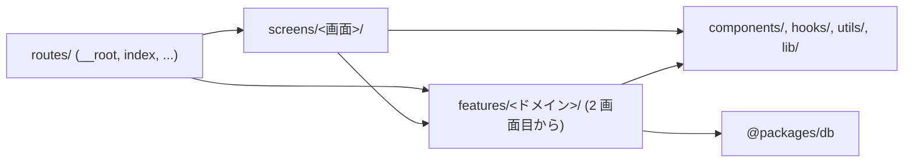

# ディレクトリ構成

`apps/app` の置き場所の規約。**新しいファイルを作る前にここを読み、[置き場所の判断フロー](#置き場所の判断フロー)で置き場所を決める。**

## 設計の考え方

ディレクトリの分け方には 2 つの軸がある。

| 軸 | 何で分けるか | 強い点 | 弱い点 |
| --- | --- | --- | --- |
| Feature 型 | ドメイン | 疎結合・高凝集になり、影響範囲が限定される | ドメインの境界が曖昧になり、ドメイン間で処理が重複する |
| Layer 型 | 技術 | 階層を作ることで、共通化によって生じる依存の向きを整理できる | 階層の定義が曖昧になり、必要以上の階層ができて依存が複雑になる |

どちらかが正しいのではない。**弱点が互い違いなので、組み合わせて打ち消す。**

### Layer を外枠にする

**外枠は Layer で切る。** `routes/` `screens/` と、共有層（`components/` `hooks/` `utils/` `lib/`）がそれ。

理由は、**依存の向きを固定する装置が最初から要る**からである。複数箇所から同じ処理を参照すれば依存が生まれる。**依存で問題になるのは依存の方向であって、依存があること自体ではない。** Layer は、その方向を一方向に固定するための装置である。技術の単位で階層を切り、上から下へだけ参照させる。

この向きは [lint で強制している](#lint-で強制している)。規約を読まなくても、逆向きに書いた時点で `pnpm lint` が落ちる。**外枠を Layer にすると、この強制が構造そのものに乗る。**

Layer 型の弱点は「階層の定義が曖昧になり、必要以上の階層ができて依存が複雑になる」ことだった。これは[先に共通化しない](#先に共通化しない)で抑える。**器を先に作らず、2 つ目の参照元が現れてから掘る。**

### Feature は内側に入れ子にする

Layer だけではドメインの凝集が作れない。ユーザーの型・取得・表示が `types/` `api/` `components/` に散ると、1 つ直すのに 3 か所を開くことになる。そこで **Layer の内側を Feature で切る。**

`screens/user-list/components/users/` がそれ。`screens/user-list/` という Layer の中に、`users` というドメインの単位を作っている。

**Feature どうしは、直接参照しない。** 影響範囲が限定されることが Feature の唯一の利点なので、ドメイン A がドメイン B の中身を参照した瞬間、A を触ると B が壊れるようになり、利点が消える。残るのは弱点（境界が曖昧・処理が重複）だけになる。組み合わせるのは画面の仕事で、共有したくなったら外側の Layer へ上げる。

### 境界は、関係者と共有できる言葉で引く

Feature 型が破綻する典型は、**エンジニアだけで分割点を決めること**にある。実装の都合で引いた境界は、プロダクトの言葉と一致しないので、同じデータを扱う処理が境界の両側に生まれる。

ドメインの境界は、**プロダクトの言葉**（企画やデザインの会話に出てくる名前）から引く。「SSR 用」「クライアント用」のような、どう実装するかによる区切りでは引かない。それは実装の都合であって、エンジニア以外は使わない言葉だからだ。

URL と画面の単位が Feature の境界に向くのは、まさにこの点による。エンジニア以外とも共通認識を持てるので、境界が言葉として安定する。ファイルベースルーティングが Feature 型と相性が良いのはそのためである。

### URL の定義と画面の実体を分ける

`routes/` は **URL を定義する場所**であって、画面を書く場所ではない。ルートファイルはルートの契約（URL・`head`・`loader`・パラメータの受け取り）だけを持ち、画面の実体は `screens/` にある。

分ける理由は 2 つある。

- **ルートの入れ子は URL 設計で決まっていて、コードの凝集で決まっていない。** 画面の中身を `routes/` に置くと、URL を変えただけでコードが丸ごと動く
- **`routes/` の中では、TanStack Router が名前でファイルを解釈する。** `__root.tsx` や `$slug.tsx` のような綴りが規約であり、`routeTree.gen.ts` の生成対象にもなる。`routes/` の外なら、この衝突は起こらない

### 入れ子にする

Layer と Feature は交互に入れ子にできる。`screens/user-list/`（Layer）の中に `components/users/`（Feature）を切り、その中でまた `types/` を切る、という形。

この入れ子はどの深さでも同じ考え方で繰り返せるので、階層が深くなっても判断の仕方は変わらない。

**掘るディレクトリの名前は、どの深さでも同じ。** `components/` `hooks/` `types/` `utils/` を使う。違うのは、その中身がドメインのものか、その画面だけのものかだけ。

### 先に共通化しない

**「あとで使うかも」で層を上げない。** 参照元が 1 つのまま依存だけが増え、Feature の強み（影響範囲が読める）を捨てて、Layer の弱み（階層が増えて依存が複雑になる）だけを受け取ることになる。2 つ目の参照元が実際に現れてから上げる。

**ドメインも例外にしない。** そのドメインを使う画面が 1 つのうちは、`screens/<画面>/components/<ドメイン>/` に置く。2 つ目の画面が使い始めたら `features/<ドメイン>/` へ上げる。

上げる前と後で、中の形は変わらない。動かすのはディレクトリの位置と import のパスだけ。

| 状態 | 置き場所 |
| --- | --- |
| 1 つの画面から使う | `screens/<画面>/components/<ドメイン>/` |
| 2 つ以上の画面から使う | `features/<ドメイン>/` |

同じ判断を共有層にも当てる。ドメインを知らない部品も、2 つ目の参照元が現れてから `components/ui/` へ上げる。

## 全体像

```text
apps/app/
├─ scripts/                ビルド・運用時だけ動くコード。ブラウザに載らない
├─ public/                 そのまま配信される静的ファイル
└─ src/
   ├─ routes/              URL の定義だけ。画面の実体は置かない
   ├─ screens/             画面の実体。1 画面 1 ディレクトリ。ドメインを組み合わせる
   │  └─ <画面>/
   │     ├─ index.tsx      画面のルートコンポーネント
   │     ├─ components/    その画面で使う部品
   │     │  └─ <ドメイン>/  その画面だけが使うドメイン
   │     ├─ hooks/         その画面だけの状態・副作用
   │     ├─ types/         その画面だけの型
   │     └─ utils/         その画面だけの整形・計算
   ├─ components/          ドメインを知らない共有部品
   │  ├─ ui/               単体で完結する UI 部品
   │  └─ layout/           サイト共通の枠
   ├─ hooks/               ドメインを知らない共有 hooks
   ├─ utils/               ドメインを知らない純粋関数
   ├─ lib/                 外部ライブラリをこのアプリ用に設定したもの
   ├─ styles/              グローバル CSS
   ├─ router.tsx           ルーター定義
   └─ routeTree.gen.ts     TanStack Router が生成。手で触らない
```

**`features/` はここにない。** 2 つ目の画面が同じドメインを使い始めたときに作る（[先に共通化しない](#先に共通化しない)）。作るときの形は次のとおり。

```text
   ├─ features/            2 つ以上の画面から使うドメイン
   │  └─ <ドメイン>/
   │     ├─ api/           そのドメインのデータ取得（server function）
   │     ├─ components/    そのドメインを表示する部品
   │     ├─ hooks/         そのドメインの状態・副作用
   │     ├─ types/         そのドメインの型
   │     └─ utils/         そのドメインの整形・計算
```

どの階層も、**必要なディレクトリだけ作る。** 全部そろえない。1〜2 個のうちは `index.tsx` の横に平置きし（`screens/login/mode-button.tsx`）、3 つ目が来てから `components/` を掘る。

`components/ui`・`components/layout`・`hooks`・`utils` は空の状態で始まる。**必要になったらこのパスに作る。別の名前のディレクトリを新設しない。**

`scripts/` はサブディレクトリを作らずフラットに置き、ファイル名で役割を表す。

**`screens/<画面>/api/` は作らない。** データ取得は `routes/` の `loader` から呼ぶ。呼ぶ先は、そのドメインが 1 画面のうちは `screens/<画面>/components/<ドメイン>/api/`、`features/` へ上げたあとは `features/<ドメイン>/api/`。複数のドメインをまたぐ画面も、組み合わせるのは `loader` の仕事。

### ドメインと共有層の違い

**ドメインの言葉で名前が付くかどうか**で分ける。付くならドメインの単位で 1 ディレクトリにまとめ、付かないなら共有層（`components/` `hooks/` `utils/` `lib/`）へ。

`lib/` は**外部ライブラリをこのアプリ用に設定したもの**を置く場所である。fetch の shim、クライアント SDK のラッパーなど。ドメインは入らない。

| 置きたいもの | 行き先 |
| --- | --- |
| ユーザーの取得・型・一覧表示 | `screens/<画面>/components/users/`。2 画面目が使ったら `features/users/` |
| fetch の差し替え | `lib/` |
| 日付を整形する | `utils/` |
| ボタン・モーダル | `components/ui/` |

**ドメインに属するものを技術で切り分けて別の場所に置かない。** 同じドメイン名のディレクトリが複数の層にでき、そのたびにどちらに置くかを考えることになる。ユーザーの型・取得・表示は、どこにあろうと 1 か所にまとめる。

`lib/` の切り方は bulletproof-react と同じ。向こうでも `lib/` は「アプリ用に事前設定された再利用可能なライブラリ」で、ドメインに属するものは api・components・hooks・types まで全部ドメインのディレクトリに入る。違うのは、そのディレクトリを最初からアプリ直下に置くか、使う画面の中に置くかだけ。

### `@packages/*` の扱い

| パッケージ | 誰が触るか |
| --- | --- |
| `@packages/db` | ドメインの `api/` だけ |
| `@packages/auth` | 制限しない |

`@packages/db` はデータそのものなので、ドメインの中に閉じる。**画面や共有層から DB を引かない。**

`@packages/auth` の `auth-client` は better-auth が用意するクライアント SDK で、性質としては `lib/` に置くものと同じ。ドメインではないので、画面から直接使ってよい（bulletproof-react も認証クライアントを `lib/` に置いている）。サーバー側の `auth` は `routes/api/auth/` が使う。

**DB スキーマの型を画面まで通さない。** `@packages/db` の型が要るときは、そのドメインの `types/` で受けてから渡す（`users/types/user.ts`）。ここを挟んでおくと、テーブル定義を変えても画面側の import が動かない。

### 画面のディレクトリは URL の入れ子を写さない

`screens/` はフラットに並べ、**画面そのものを指す言葉**で名前を付ける。

| ルート | ルートファイル | 画面 |
| --- | --- | --- |
| `/` | `routes/index.tsx` | `screens/top/` |
| `/login` | `routes/login.tsx` | `screens/login/` |
| `/users/<id>` | `routes/users/$id.tsx` | `screens/user-detail/` |

URL を写すと、`routes/` と同じ木がもう 1 本できて、URL を変えるたびに両方を動かすことになる。名前を画面側の言葉にしておけば、導線の都合で URL が変わっても画面は動かない。

### `-` で始まるディレクトリは使わない

TanStack Router は `-` で始まるファイル・ディレクトリをルート生成から除外するので、`routes/-components/` のようにコロケーションもできる。**これは使わない。**

画面の実体を `routes/` の外に置けば、ルーティング対象かどうかを名前で示す必要がなくなる。`routes/` にあるものは全部 URL の定義、それ以外は全部 `routes/` の外、という 1 本の線で足りる。

### `screens` という名前

`pages` にしない。`routes` と `pages` は語としてほぼ同義で、**URL の定義と画面の実体という違いが名前から読み取れない。** `screens` なら、ルーティングの話をしているのか画面の話をしているのかが、パスを見た時点で分かる。

`screens/<画面>/` の仕事は、**ドメインを組み合わせて 1 画面にすること。** `index.tsx` 自体はドメインのロジックを持たず、並べるだけ。

## 置き場所の判断フロー

新しいファイルを作るとき、上から順に当てはめる。

1. **ビルド時・運用時にしか動かないか**（Vite plugin、生成スクリプト、Node API を使う）→ `scripts/`
2. **URL を増やす／変えるか** → `src/routes/`
3. **画面そのものか** → `src/screens/<画面>/index.tsx`
4. **ドメインの言葉で名前が付くか** → そのドメインを使う画面が 1 つなら `src/screens/<画面>/components/<ドメイン>/`、2 つ以上なら `src/features/<ドメイン>/`
5. **その画面の組み立てにしか意味がないか** → `src/screens/<画面>/` の `components/` `hooks/` `types/` `utils/`
6. **ドメインを知らない表示部品か** → `src/components/ui/`・`src/components/layout/`
7. **ドメインを知らない hooks か** → `src/hooks/`
8. **副作用のない汎用関数か** → `src/utils/`
9. **外部ライブラリの設定・ラッパーか** → `src/lib/`

**迷ったら 4。** ドメインの言葉で名前を付けられるなら、ドメインの単位で 1 ディレクトリにまとめる。

4 と 5 は同じ「どこに置くか」に見えるが、**分けて数える意味がある。** 4 はドメインの単位で 1 か所にまとめる話、5 はその画面の都合でしかないものを置く話。「ユーザー一覧カード」は 4、「ログイン画面のモード切替ボタン」は 5 になる。

4 でまとめておけば、2 つ目の画面が同じドメインを使い始めたとき、**そのディレクトリごと `features/` へ動かすだけで済む。** 型・取得・表示が層をまたいで散っていると、この移動が段違いに重くなる。

## 各層の責務

| 場所 | 責務 | やらないこと |
| --- | --- | --- |
| `scripts/` | 生成処理、デプロイ補助、Vite plugin | React を書く |
| `src/routes/**/*.tsx` | URL の契約。`head`・パラメータの受け取り・`loader` からドメインのデータ取得を呼ぶ。受け取った値を `screens/` へ渡す | マークアップを書く。整形・集計する。DB を引く |
| `src/screens/<画面>/index.tsx` | 画面の組み立て。ドメインを並べる | URL を知る。`head` を持つ。ドメインのロジックを持つ |
| `src/screens/<画面>/components/<ドメイン>/` | そのドメインのデータ取得・型・表示・整形 | 他のドメインを参照する。画面と URL を知る |
| `src/screens/<画面>/` の `components/` `hooks/` `types/` `utils/` | その画面の組み立てにしか使わないもの | 他の画面から参照される |
| `src/features/<ドメイン>/` | 2 つ以上の画面から使うドメイン。中身の責務は上と同じ | 他の features を参照する。画面と URL を知る |
| `src/components/ui/` | 単体で完結する見た目の部品 | ドメインの型を知る |
| `src/components/layout/` | サイト共通の枠 | ドメインの型を知る |
| `src/hooks/` | ドメインを知らない React の状態・副作用 | ドメインの型を知る |
| `src/utils/` | 副作用のない純粋関数 | ドメインの型を知る。React に依存する |
| `src/lib/` | 外部ライブラリのラッパー・設定 | ドメインを知る |

**ドメインの責務は、`screens/` の中にあっても `features/` に上げても変わらない。** 変わるのは何画面から使えるかだけ。だから昇格は移動で済む。

ルートファイルを薄く保つのは、**URL の契約と、中身の実装を別々に読めるようにするため。** 画面を `screens/` に置いておけば、URL を変えても画面は動かない。

## 依存の方向

矢印の向きにだけ import する。逆向きが必要になったら、設計を間違えている。



守るルール。

- **`src/` から `scripts/` を import しない。** ブラウザに Node のコードが載る
- **ドメインどうしは参照しない。** `screens/user-list/components/users/` から `screens/user-list/components/orders/` を import しない。組み合わせるのは `screens/<画面>/index.tsx` の仕事。共有したくなったら外側の層へ上げる
- **画面どうしは参照しない。** `screens/<画面A>/` から `screens/<画面B>/` を import しない。他の画面が欲しがったら、それが `features/` へ上げる合図
- **`features/` から `screens/`・`routes/`・他の `features/` を import しない。** ドメインが画面や URL に依存すると、別の画面から使えなくなる
- **`screens/` から `routes/` を import しない。** 画面が URL を知ると、URL を変えたときに画面が壊れる
- **共有層（`components/` `hooks/` `utils/` `lib/`）は `features/`・`screens/`・`routes/` を import しない。** ドメインを知らない部品にしておく
- **`@packages/db` に触るのはドメインの `api/` だけ。** 画面・共有層・`routes/` から DB を引かない
- **`routes/` にロジックを書かない。** `loader` の中で組み立てたくなったら、ドメインのディレクトリへ出す

`routeTree.gen.ts` はこの向きの対象外。TanStack Router が全ルートを集める生成物なので、手で編集しない。

### lint で強制している

最後の 1 つ（`routes/` にロジックを書かない）以外は `.oxlintrc.json` の `overrides` + `no-restricted-imports` で `pnpm lint` が落ちる。違反すると、どこに置くべきかを書いたメッセージが出る。

| ここから | これを import できない |
| --- | --- |
| `src/routes/**` | `scripts/`、`@packages/db` |
| `src/screens/**` | `scripts/`、`routes/`、他の画面、`@packages/db` |
| `src/features/**` | `scripts/`、`routes/`、`screens/`、他の features |
| `src/components/**`・`src/hooks/**`・`src/utils/**`・`src/lib/**` | `scripts/`、`routes/`、`screens/`、`features/`、`@packages/db` |

知っておくべき制約が 2 つある。

- **oxlint の `overrides` は、同じルールが複数のブロックにマッチすると最後のブロックが前のブロックを置き換える**（合成されない）。そのためディレクトリごとのブロックに共通ルールを書き写している。ルールを足すときは該当する全ブロックに入れる
- **判定は import 文の文字列に対するパターンマッチで、解決後のパスではない。** そのため `@/` エイリアス形（`@/screens/**`）に加えて、相対パス形（`**/screens/**`）も同じ group に入れて塞いである。`../../screens/top` のような書き方でも落ちる

ドメイン直下のファイル（`features/<ドメイン>/*.ts`）は `../` が必ずドメインの外に出るので、そこだけ `../**` も禁止している。**ドメインの中で 2 階層以上さかのぼって隣のドメインへ行く形だけは、正当な `../../types/...` と文字列で区別できないため lint に入れていない。** ここはレビューで見る。

`src/features/**` のルールは、`features/` がまだ無い状態でも消さない。**作った瞬間から効かせるため。**

**画面の中のドメインどうしの参照も、lint で止まらない。** `screens/user-list/components/users/` から `screens/user-list/components/orders/` を import しても通る。同じ画面の中は相対パスで書くので、機械的に区別できないからだ。ここもレビューで見る。

## 命名

**パスに現れるものは、ディレクトリもファイルもすべて kebab-case。** 大文字は使わない。PascalCase になるのは、コードの中の識別子（コンポーネント名・型名）だけ。

大文字小文字を混ぜないのは、**混ぜた瞬間に環境差で踏むから。** macOS はファイル名の大文字小文字を区別せず、CI（Linux）は区別する。ローカルで通ったものがビルドで落ちる。`git mv` での大文字小文字だけの改名も、macOS では一度別名を経由しないと通らない。全部小文字なら、この差は起こりようがない。

| 対象 | 記法 | 例 |
| --- | --- | --- |
| URL になるディレクトリ・ファイル | kebab-case | `routes/users/`, `routes/login.tsx` |
| 動的セグメント | `$` プレフィックス | `routes/users/$id.tsx` |
| TanStack Router の予約ファイル | 規約どおり | `__root.tsx`, `routeTree.gen.ts` |
| 画面のディレクトリ | kebab-case | `screens/top/`, `screens/user-detail/` |
| ドメインのディレクトリ | kebab-case。プロダクトの言葉 | `screens/user-list/components/users/`, `features/users/` |
| 分類のディレクトリ | kebab-case | `components/`, `ui/`, `layout/`, `api/`, `hooks/`, `types/`, `utils/`, `scripts/` |
| モジュール・コンポーネントのファイル | kebab-case | `components/ui/button.tsx`, `users/api/get-users.ts` |
| React コンポーネント・型 | PascalCase の名前付き export | `button.tsx` が `Button` を export |
| 関数・変数 | camelCase | `getUsers`, `formatDate` |

**ファイル名とその中の識別子は、綴りだけ変えて対応させる。** `user-card.tsx` が `UserCard` を export する。default export は使わない。

部品に CSS やテストを添えたくなったら、**kebab-case のディレクトリを切って `index.tsx` に置く**（`components/ui/button/index.tsx`）。1 ファイルで済むうちは切らない。

**バレルファイル（`index.ts` で再 export するだけのファイル）は作らない。** Vite の tree shaking を妨げる。上の `button/index.tsx` はコンポーネントの実体なので当たらないが、`users/index.ts` のようにドメインの中身をまとめて再 export するのは禁止。実装ファイルを直接 import する。

**画面の名前は URL ではなく、画面そのものを指す言葉で付ける。** URL は導線の都合で変わるが、その画面が何をする場所かは変わらない。ルート（`/`）だけは URL に名前がないので `top` とする。

ドメインのディレクトリの中のファイル名は、**プロダクトの言葉をそのまま使う。** 実装の都合で付けた名前（`helper.ts`、`common.ts`、`manager.ts`）は、どのドメインの何を扱うか分からなくなるので使わない。

**import のパスは `git ls-files` の表記と一字一句合わせる。** パスを全部 kebab-case にしているのは、この一致を保ちやすくするためでもある。

### import の書き方

ディレクトリを越える import には `@/` エイリアス（`tsconfig.json` で `./src/*`）を使う。`../../../components/...` のような相対パスは、階層が変わるたびに壊れるうえ、依存の向きが読み取れない。

**自分の画面・自分のドメインの中を指すときだけ `./` で始まる相対パスを使う。** `screens/user-list/components/users/user-card.tsx` から `./types/user` のように書く。中身はまとめて動くので、相対のほうが移動に強い。ドメインを `features/` へ上げるときも、中の import はそのままで済む。

## テストの置き場所

対象実装と同じディレクトリの `__tests__/` 配下に置く。画面やドメインのディレクトリを移動するときは、テストも一緒に動く。

## 入口が増えたとき

入口が 1 つのうちは、`screens/` をフラットに並べる。

管理画面や外部向け API のような **2 つ目の入口**ができたら、`screens/<入口>/<画面>/` の形にして 1 段挟む。入口どうしは参照せず、共有したいものは `features/` か共有層へ上げる、という考え方は同じ。

**この形にするのは、実際に 2 つ目の入口ができてから。** 先に器を作ると、1 つしかない入口の名前が全パスに乗るだけになる。

## 全体像にないディレクトリ

次の 3 つは条件を満たすまで作らない。

| ディレクトリ | 作る条件 |
| --- | --- |
| `features/` | 2 つ目の画面が同じドメインを使い始めたとき |
| `stores/` | 複数のドメインをまたぐクライアント状態が出てきたとき |
| `types/` | 複数のドメインで共有する型が出てきたとき。ドメインの型はそのドメインのディレクトリの中 |

**どれも「実際にそうなってから」作る。** 器を先に置いても、中身が 1 つのうちは読みやすくならない。
